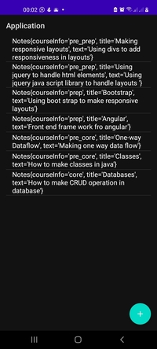
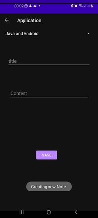
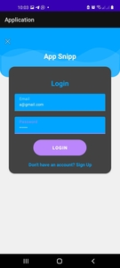
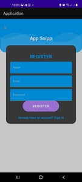

# Note taking Application
- This application to take notes
----
- <a href="https://ufile.io/gl3z2rth" target="_blank">ip1</a>
- <a href="https://ufile.io/xkh9l0hl" target="_blank">ip2</a>
- <a href="https://ufile.io/7d8kur9p" target="_blank">ip3</a>

---
**Version1.0.0**

---

---


---
## preview





---

## Authors
- Nicholas Barkote <nicholas.kebut@student.moringaschool.com>
---

## Requirements
- ubuntu or any os with jdk
- IntelliJ


## Setup Instructions

* clone it to your desktop
```bash
 git clone  https://github.com/barkotenicholas/project.git
   ```
* Open the project with Android Studio

# Tech Stack

- java
- gradle
- html
- bootstrap


## Contact Information

<a href="mailto:barkotenicholas@gmail.com">barkotenicholas@gmail.com</a>


## License & copyright

© Nicholas k Barkote , Moringa school student

Licensed under the [MIT License](LICENSE)